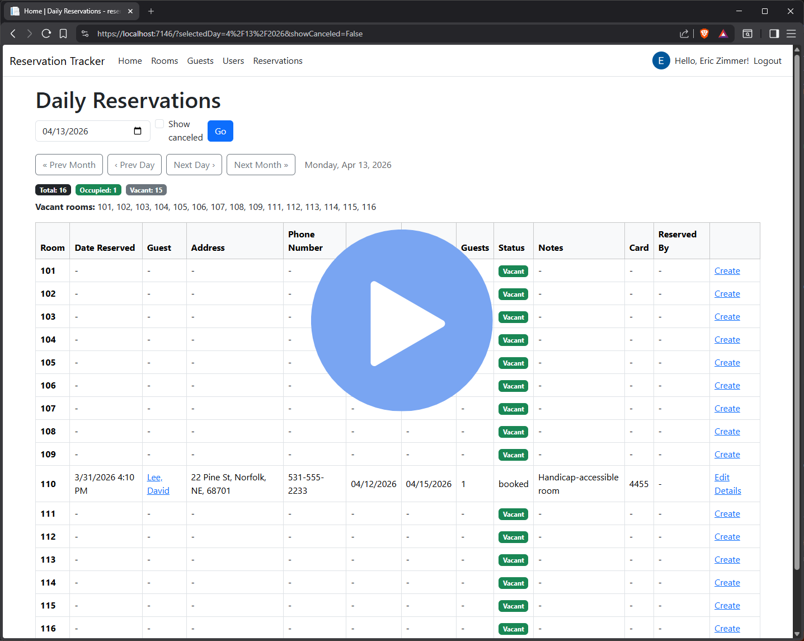
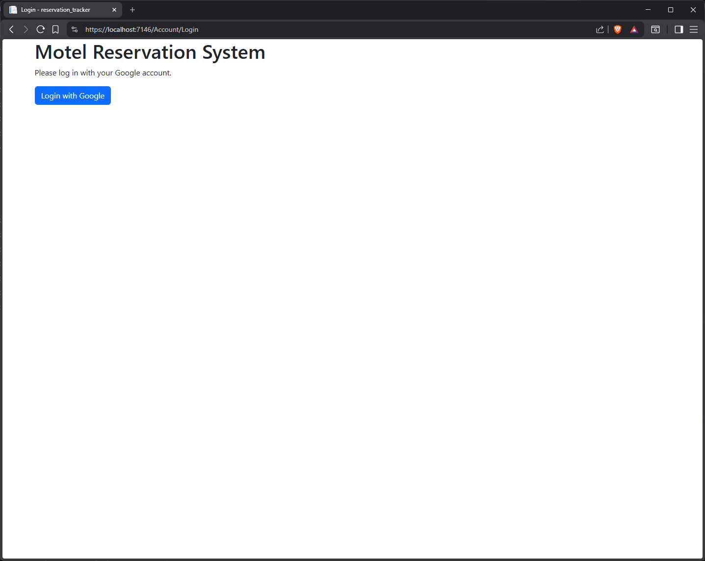
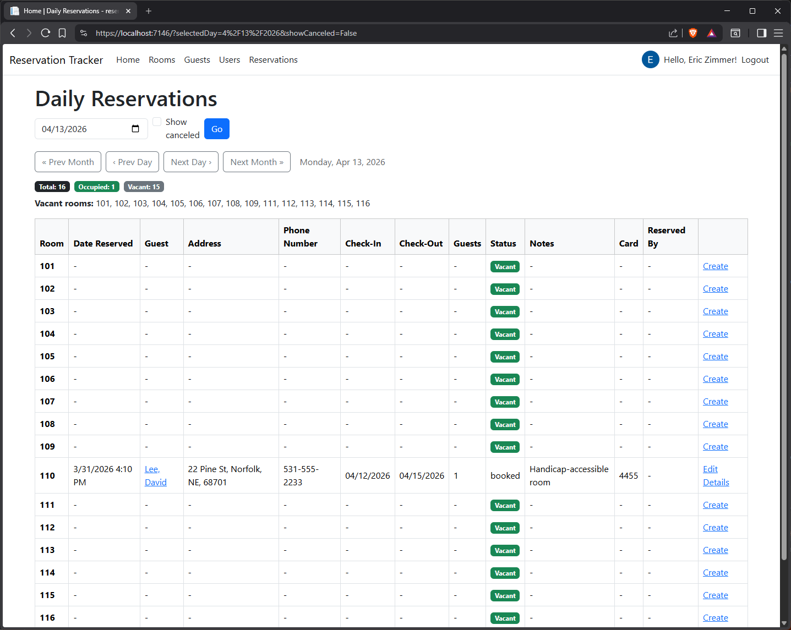
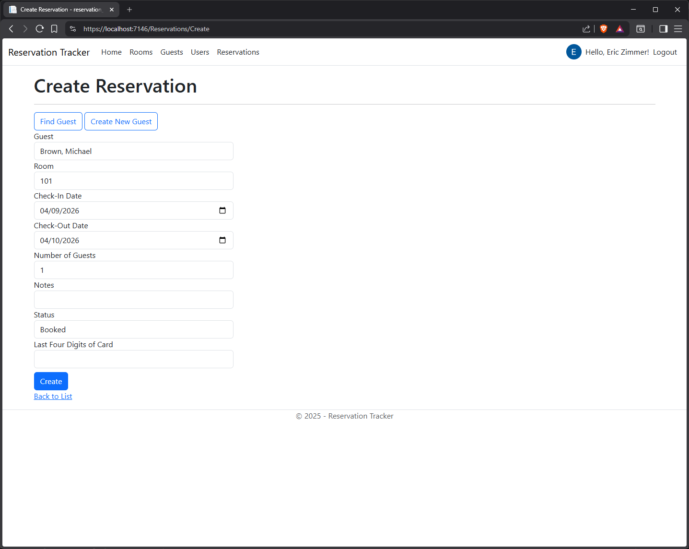
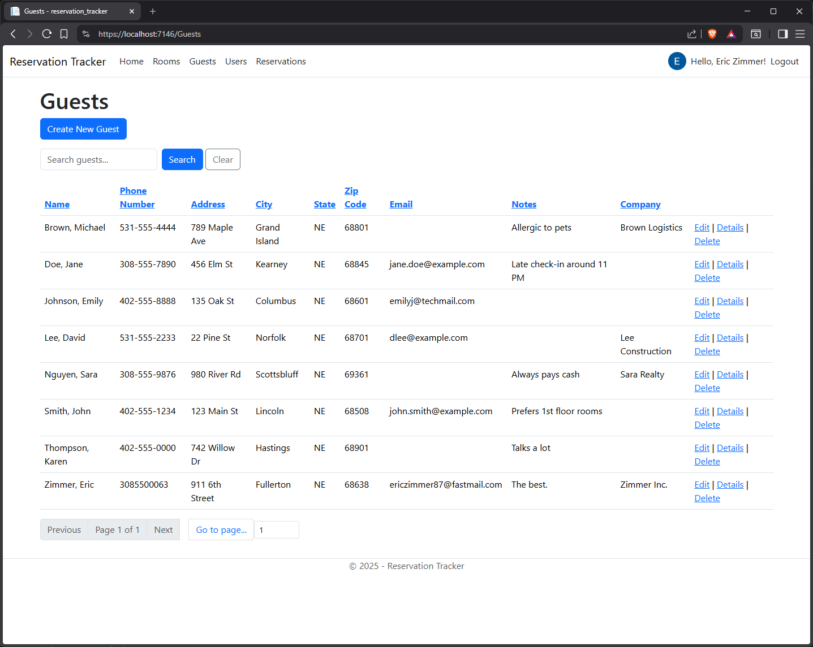
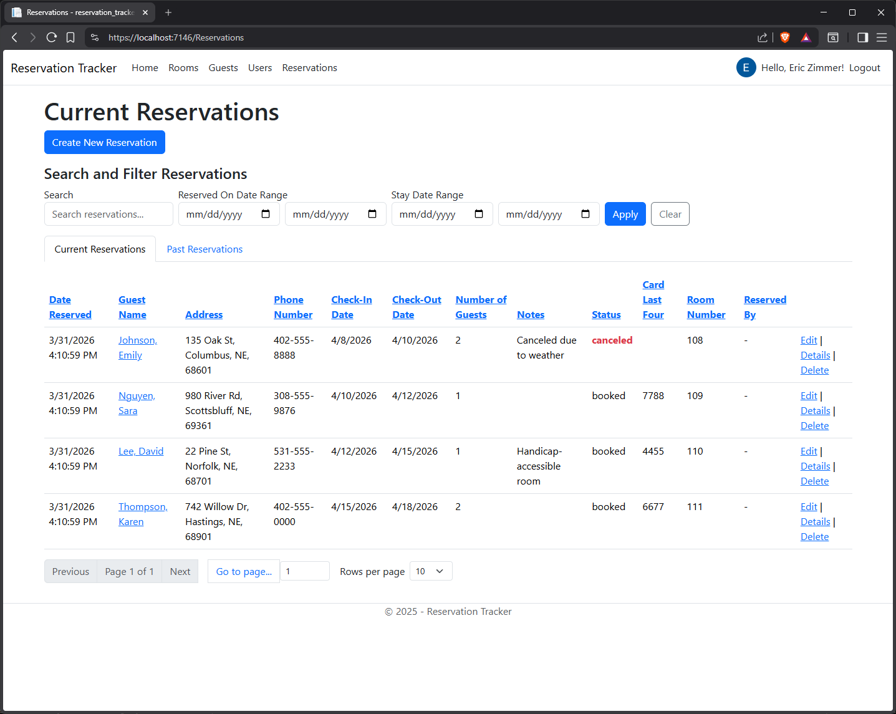

# Reservation Tracker

This is a full-featured ASP.NET Core MVC web application designed to manage motel reservations efficiently. This system streamlines guest bookings, room assignments, and administrative tasks through a secure and intuitive interface.

## Overview

Reservation tracker is a database-driven web application built to solve real-world challenges in small hospitality businesses. It enables staff to manage reservations, track guests, and oversee rom availability with accuracy and ease.

This project demonstrates proficiency in modern web development using ASP.NET Core MVC, Entity Framework Core, SQL Server, and authentication via Google OAuth.

## Demo

[](https://www.youtube.com/watch?v=oY3ARbr2a68)

_2-minute walkthrough of key features_

## Features

- Secure Authentication
  - Google OAuth login using ASP.NET Core Identity
  - Authorization for protected application access
- Reservation Management
  - Create, view, edit, and delete reservations
  - Track check-in and check-out dates
  - Prevent scheduling conflicts
- Guest Management
  - Maintain guest records and contact information
  - Associate guests with reservations
- Room Management
  - Organize rooms by number and type
  - Assign rooms to reservations
- Administrative Controls
  - Role-based access
  - Admin privileges for managing users
- User Tracking
  - Records which authenticated user created or modified reservations
- Database-First Design
  - Built using Microsoft SQL Server with Entity Framework Core scaffolding
- Responsive UI
  - Clean interface built with Bootstrap

## Tech Stack

| Category            | Technology                           |
| ------------------- | ------------------------------------ |
| Framework           | ASP.NET Core MVC                     |
| Language            | C#                                   |
| ORM                 | Entity Framework Core                |
| Database            | Microsoft SQL Server                 |
| Authentication      | ASP.NET Core Identity & Google OAuth |
| Frontend            | Razor Views, HTML, CSS, Bootstrap    |
| Hosting Environment | Docker (SQL Server)                  |
| Development Tools   | Visual Studio, SSMS                  |
| Version Control     | Git & GitHub                         |

## Database Schema

This application uses a relational SQL Server database designed for reliability and scalability. Key tables include:

- Users
- Guests
- Rooms
- Reservations

### Reservation Status Values

- booked
- checked_in
- canceled
- blocked
- past

### Example Schema Snippet

```sql
-- RESERVATIONS TABLE
CREATE TABLE Reservations (
    ReservationId     BIGINT IDENTITY(1,1) PRIMARY KEY,
    GuestId           BIGINT NULL,
    UserId            BIGINT NULL, -- who created the reservation
    ModifiedByUserId  BIGINT NULL, -- who last modified the reservation
    RoomId            BIGINT NOT NULL,
    DateReserved      DATETIME2 NOT NULL DEFAULT SYSDATETIME(),
    ModifiedOn        DATETIME2 NULL,
    CanceledOn        DATETIME2 NULL,
    CheckInDate       DATE NOT NULL,
    CheckOutDate      DATE NOT NULL,
    NumberOfGuests    INT NOT NULL,
    Notes             VARCHAR(MAX) NULL,
    Status            VARCHAR(20) NOT NULL
        CHECK (Status IN ('booked', 'checked_in', 'canceled', 'blocked', 'past')),
    CardLastFour      VARCHAR(4) NULL,

    CONSTRAINT FK_Guest FOREIGN KEY (GuestId)
        REFERENCES Guests(GuestId) ON DELETE NO ACTION,

    CONSTRAINT FK_User FOREIGN KEY (UserId)
        REFERENCES Users(UserId) ON DELETE NO ACTION,

    CONSTRAINT FK_ModifiedByUser FOREIGN KEY (ModifiedByUserId)
        REFERENCES Users(UserId) ON DELETE NO ACTION,

    CONSTRAINT FK_Room FOREIGN KEY (RoomId)
        REFERENCES Rooms(RoomId) ON DELETE NO ACTION
);
```

## Screenshots

- Login Page
  
- Daily Reservations
  
- Create Reservation Form
  
- Guest Management
  
- Reservations List
  

## Getting Started

### Prerequisites

- Visual Studio 2022 or later
- .NET 8 SDK
- SQL Server or SQL Server Express
- SQL Server Management Studio (SSMS)
- Docker (optional, for SQL Server container)

### Installation

1. Clone the repository

```bash
git clone https://github.com/yourusername/reservation-tracker.git
cd reservation-tracker
```

2. Configure the database
   - Create a SQL Server Database named `ReservationTracker`.
   - Run the provided SQL script to create tables.

3. Configure connection strings
   - Update `appsettings.json`:

```json
"ConnectionStrings": {
    "DefaultConnection": "YOUR_IDENTITY_DB_CONNECTION",
    "ReservationTracker": "YOUR_RESERVATION_DB_CONNECTION"
}
```

4. Configure Google Authentication
   - Use `secrets.json`:

```json
{
  "Authentication": {
    "Google": {
      "ClientId": "YOUR_CLIENT_ID",
      "ClientSecret": "YOUR_CLIENT_SECRET"
    }
  }
}
```

5. Apply Identity migrations

```bash
dotnet ef database update
```

6. Run the application

```bash
dotnet run
```

## Project Structure

```text
ReservationTracker/
    │── Controllers/
    │── Models/
    │── ViewModels/
    │── Views/
    │── Data/
    │── wwwroot/
    │── appsettings.json
    │── Program.cs
```

## Security Features

- ASP.NET Core Identity for authentication and authorization
- Google OAuth integration
- Secure configuration using `secrets.json`
- Protection against overposting with view models and model binding
- Anti-forgery token validation

## What I Learned

- Building scalable web applications using ASP.NET Core MVC
- Implementing database-first design with Entity Framework Core
- Integrating third-party authentication with Google OAuth
- Managing relational data and enforcing referential integrity
- Applying MVC architecture and best practices
- Deploying and configuring SQL Server with Docker
- Troubleshooting real-world issues in authentication, model binding, and validation

## Future Improvements

- Cloud deployment using Azure App Service and Azure SQL Database
- Reporting and analytics dashboards
- Email notifications for reservations
- Enhanced search and filtering
- Option to use app's own account instead of Google OAuth
- RESTful API for mobile or third-party integrations
- Automated unit and integration testing

## Author

Eric Zimmer

- GitHub: https://github.com/EricZimmer87
- Portfolio: https://www.ejzimmer.com

## License

This project is intended for educational and portfolio purposes.
