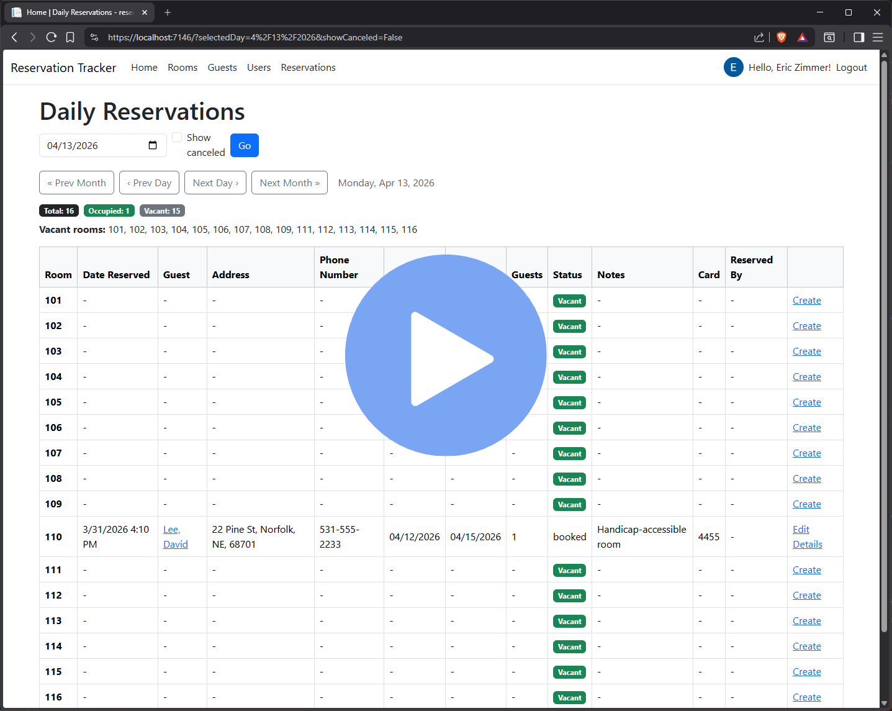
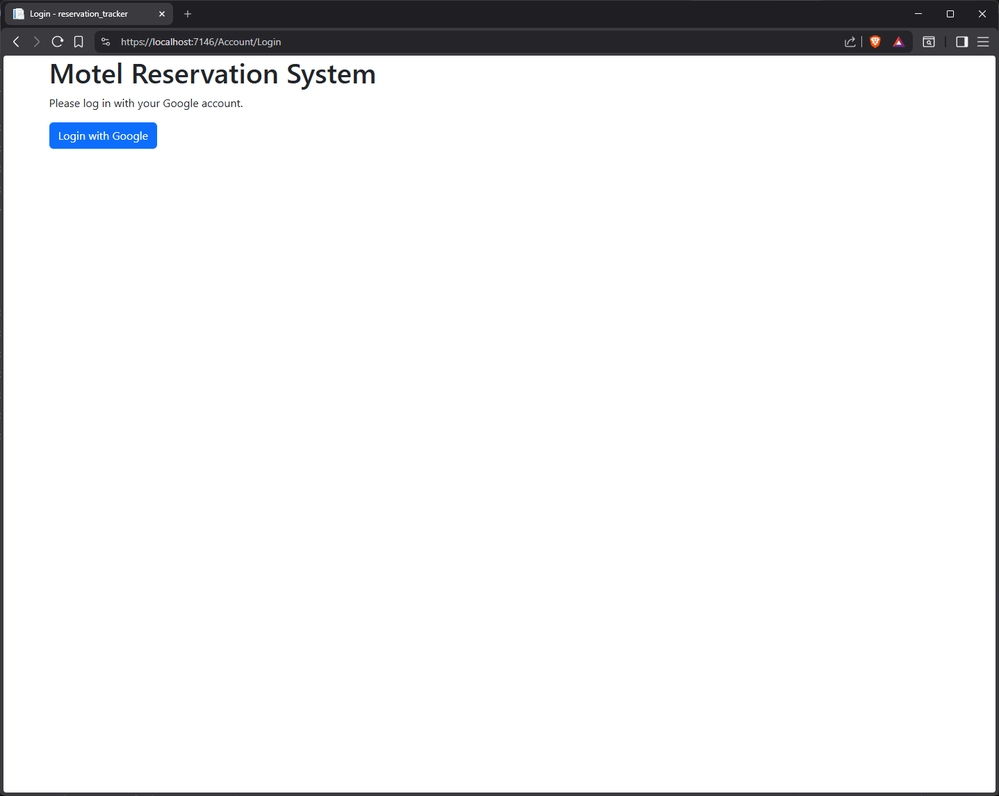
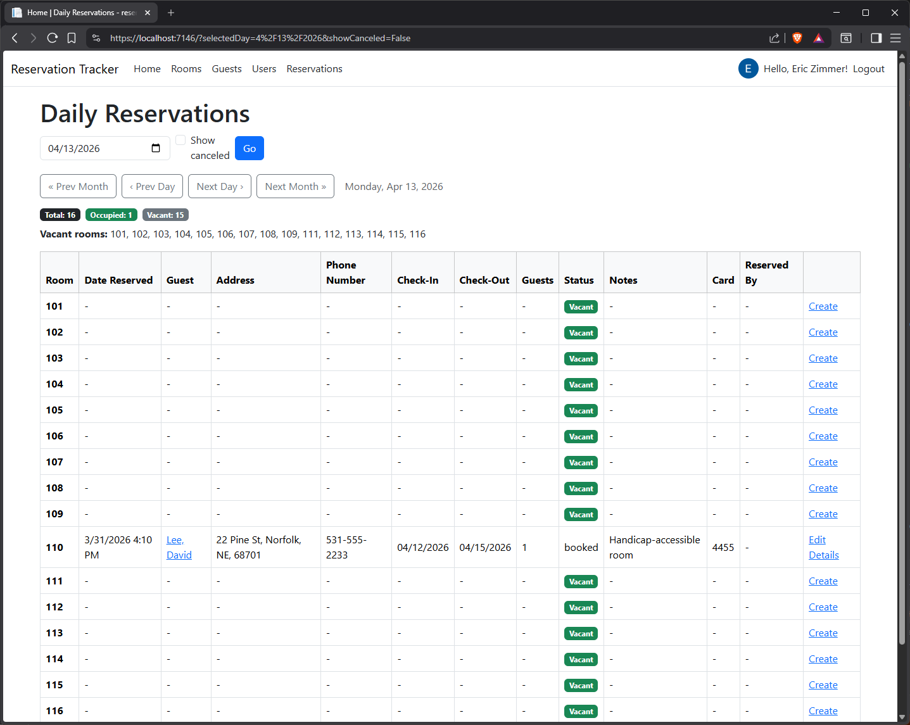
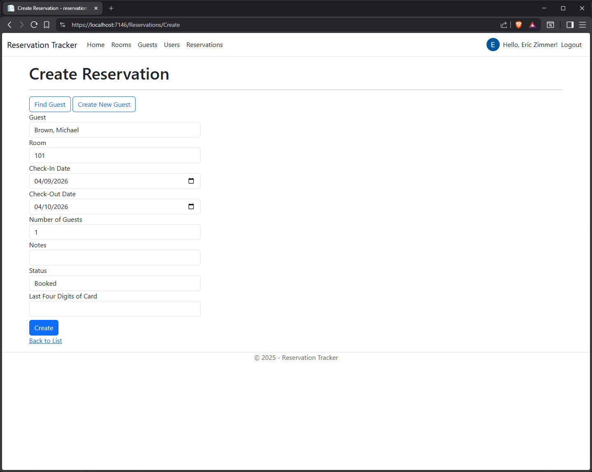
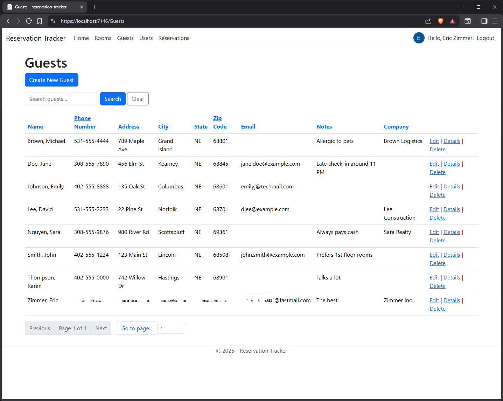
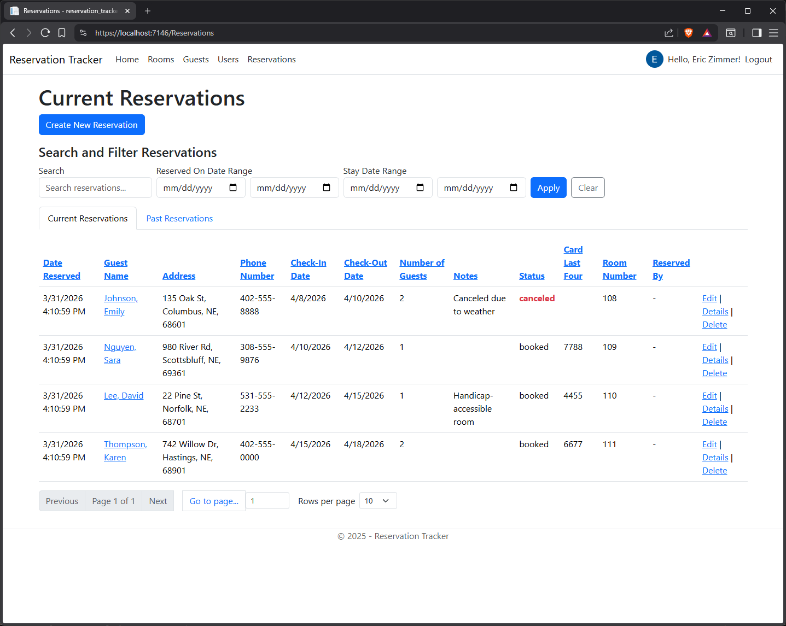

# Reservation Tracker

Reservation Tracker is an ASP.NET Core MVC application I built to manage motel reservations, guests, and room assignments. The goal was to build an app that would actually be used at the motel I work at to replace the physical books we use.

It uses SQL Server as the backend, Entity Framework Core for data access, and Google OAuth for authentication.

## Demo

[](https://www.youtube.com/watch?v=oY3ARbr2a68)

_A quick walkthrough of the application._

---

## Features

### Authentication

- Google OAuth login
- ASP.NET Core Identity
- Protected routes for authenticated users

### Reservations

- Create, edit, and cancel reservations
- Track check-in/check-out dates
- Basic conflict checking to avoid double-booking rooms

### Guests

- Store guest information
- Associate guests with reservations

### Rooms

- Manage rooms by number and type
- Assign rooms to reservations

### Admin

- Role-based authorization
- User management
- Track which user created or last modified a reservation

### Other

- Database-first design using Entity Framework Core scaffolding
- Responsive Bootstrap UI
- SQL Server backend

---

## Tech Stack

- ASP.NET Core MVC
- C#
- Entity Framework Core
- Microsoft SQL Server
- ASP.NET Core Identity
- Google OAuth
- Razor Views
- Bootstrap
- Docker (SQL Server development environment)
- Visual Studio
- SSMS

---

## Database

The application uses a relational SQL Server database with tables for:

- Users
- Guests
- Rooms
- Reservations

Reservation status values:

- booked
- checked_in
- canceled
- blocked
- past

Example:

```sql
CREATE TABLE Reservations (
    ReservationId BIGINT IDENTITY(1,1) PRIMARY KEY,
    GuestId BIGINT NULL,
    UserId BIGINT NULL,
    ModifiedByUserId BIGINT NULL,
    RoomId BIGINT NOT NULL,
    DateReserved DATETIME2 NOT NULL DEFAULT SYSDATETIME(),
    ModifiedOn DATETIME2 NULL,
    CanceledOn DATETIME2 NULL,
    CheckInDate DATE NOT NULL,
    CheckOutDate DATE NOT NULL,
    NumberOfGuests INT NOT NULL,
    Notes VARCHAR(MAX) NULL,
    Status VARCHAR(20) NOT NULL,
    CardLastFour VARCHAR(4) NULL
);
```

---

## Screenshots

**Login**



**Daily Reservations**



**Create Reservation**



**Guest Management**



**Reservations List**



---

## Running the Project

### Requirements

- Visual Studio 2022+
- .NET 8 SDK
- SQL Server or SQL Server Express
- SSMS
- Docker (optional)

### Clone

```bash
git clone https://github.com/yourusername/reservation-tracker.git
cd reservation-tracker
```

### Database

Create a SQL Server database named `ReservationTracker` and run the included SQL script.

### Connection Strings

Update `appsettings.json`:

```json
"ConnectionStrings": {
    "DefaultConnection": "...",
    "ReservationTracker": "..."
}
```

### Google OAuth

Configure `secrets.json`:

```json
{
  "Authentication": {
    "Google": {
      "ClientId": "...",
      "ClientSecret": "..."
    }
  }
}
```

### Identity

```bash
dotnet ef database update
```

### Run

```bash
dotnet run
```

---

## Project Layout

```text
ReservationTracker/
│── Controllers/
│── Models/
│── ViewModels/
│── Views/
│── Data/
│── wwwroot/
│── Program.cs
│── appsettings.json
```

---

## Possible Future Improvements

- Better reporting/dashboard pages
- Email confirmations
- Improved searching and filtering
- Native username/password login in addition to Google
- REST API endpoints

---

## About

This project was built as a portfolio piece and designed as if it were being used to solve a real-world business problem.

---

## Author

Eric Zimmer

GitHub: https://github.com/EricZimmer87

Portfolio: https://www.ejzimmer.com
